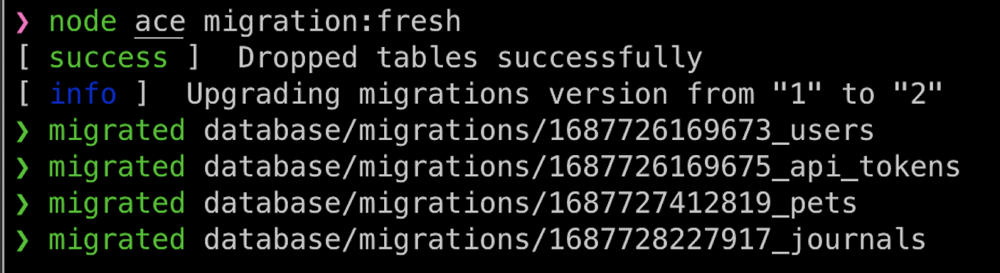
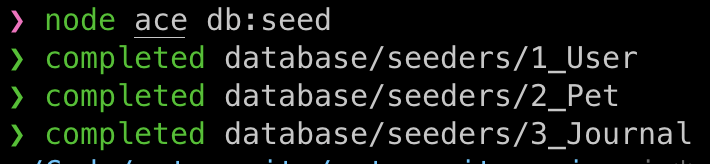
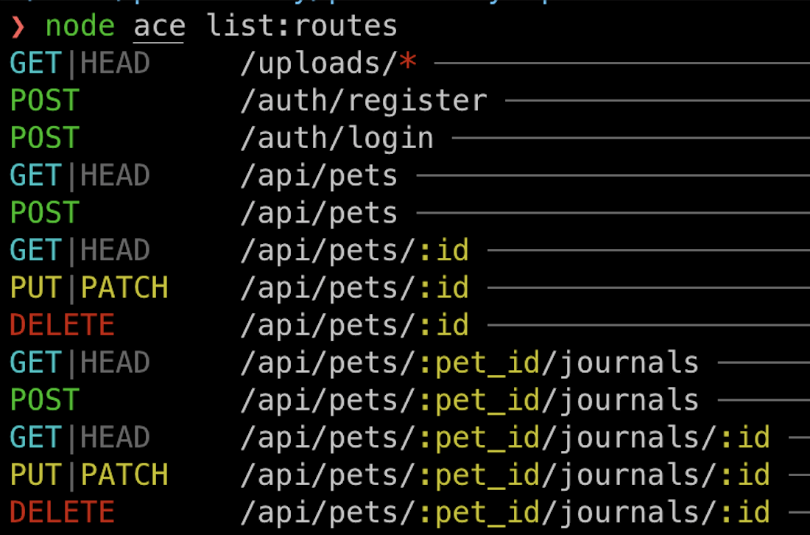
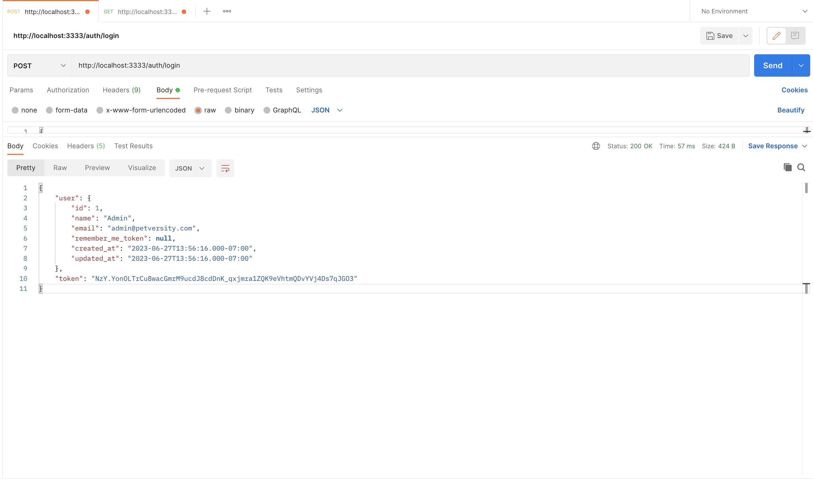
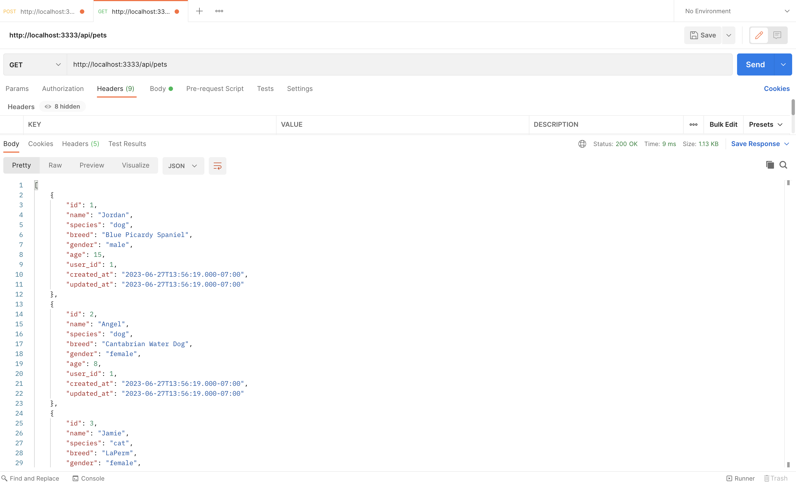
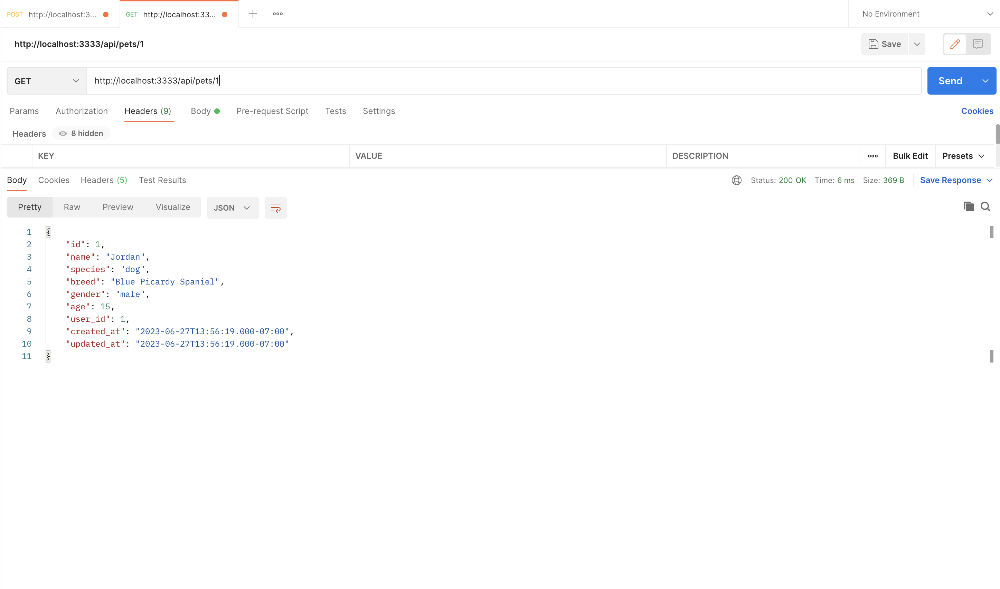
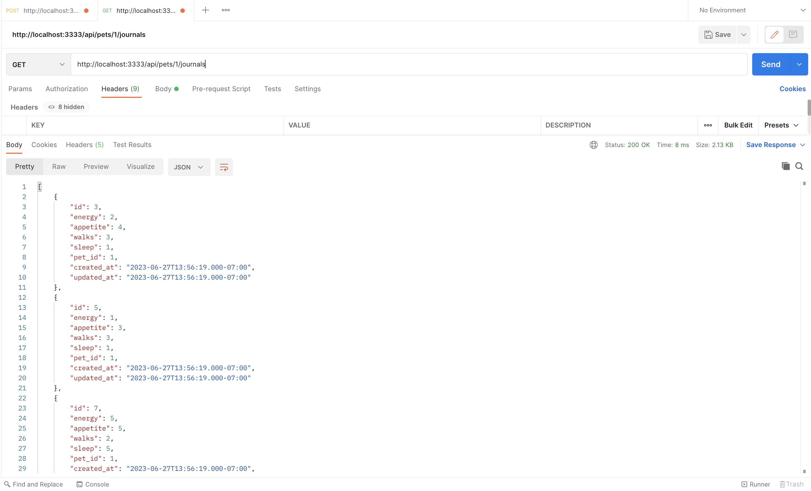
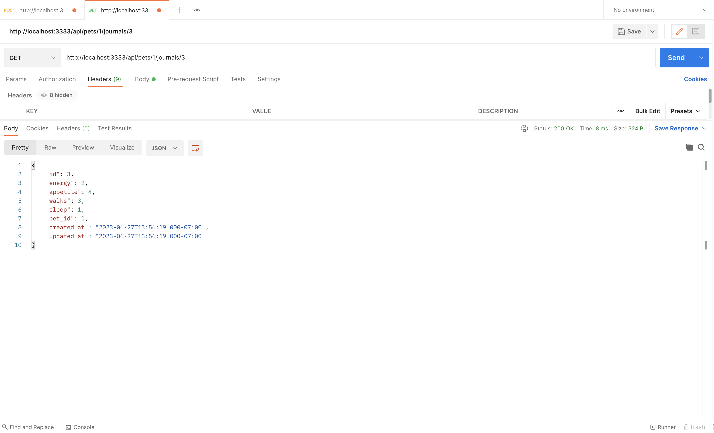

<p align="center" style="margin: 20px 0">
  
</p>

# Petversity Adonis API
### Petversity REST API written in Adonis for React client.

<br>

## Installation & Run

```bash
# Install dependencies
npm i

# Configure environment vars
See .env.example

# Migrate tables
npm run migrate

# Drop tables & migrate
npm run migrate:fresh

# Seed database
npm run seed

# Start API server
npm run dev

# Run tests
npm run test
```

<br>

## Demonstrated Concepts
- Token based user authentication with login/register methods
- Model relationships (belongsTo, hasMany)
- Routing with nested resources
- Understanding of database factories and seeding
- RESTful API concepts
- Testing endpoints
- Knowledge of Adonis ecosystem (Lucid ORM, Auth, Japa testing, etc..)

<br>

## Nice-to-Have
- Dockerize client and server apps for simpler/consistent distribution
- Tests for all resources, currently only demoing pet tests for time sake
- setup proper CORS, ignoring at the moment because this is just a demo

<br>

## API Endpoints
```bash
# Authentication
POST       /auth/register
POST       /auth/login 

# Pets
GET        /api/pets 
POST       /api/pets 
GET        /api/pets/:id 
PUT|PATCH  /api/pets/:id 
DELETE     /api/pets/:id 

# Pet Journals
GET        /api/pets/:pet_id/journals 
POST       /api/pets/:pet_id/journals 
GET        /api/pets/:pet_id/journals/:id 
PUT|PATCH  /api/pets/:pet_id/journals/:id 
DELETE     /api/pets/:pet_id/journals/:id
```

## Demo

Migrations


Seeds


Routes


Login


All User Pets


Single User Pet


User Pet All Journals


User Pet Single Journal

