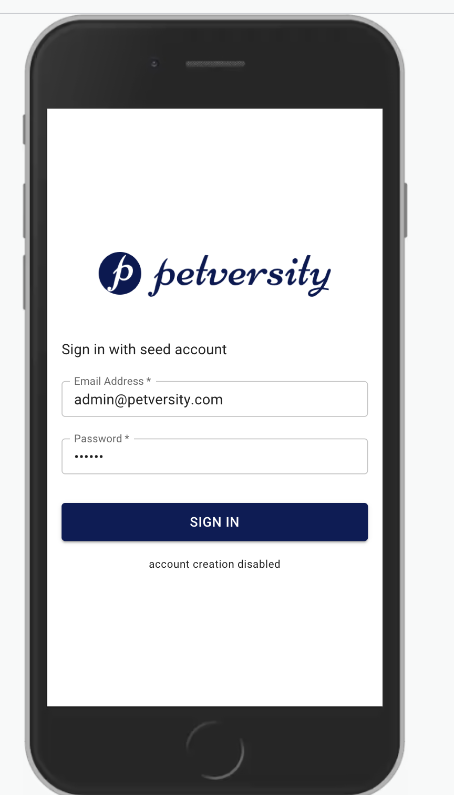

<p align="center" style="margin: 20px 0">
  
</p>

# Petversity React Client 
### Petversity Client app written in React, RTK, React Router and MUI

<br>

## Installation & Run

```bash
# Install dependencies
npm i

# Create .env in petversity.client root
Copy or rename .env.example => .env

# Run dev server
npm run dev
```

<br>

## Demonstrated Concepts
- Modern state management knowledge demonstrated with Redux Toolkit (RTK) 
- Client side routing with React Router using public and private routes
- Able to leverage popular component libraries such as Material UI (MUI)
- Demonstrated knowledge of modern React features (functional components, hooks, etc..)
- TypeScript experience

<br>

## Nice-to-Have
- Use React Hook Form for better form management
- Use RTK Query for data fetching/caching
- Implement edit/delete pets and pet journal page
- Add unit tests with Vitest

<br>

## Demo




